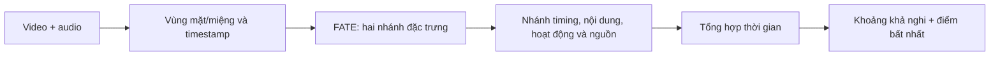

# Phát hiện và định vị bất nhất âm thanh-chuyển động môi

## 1. Bài toán

**Input:** video một người, có audio và thấy rõ miệng. **Output:** khoảng khả nghi, điểm bất nhất theo cửa sổ/clip, độ lệch và mức đủ bằng chứng. Mục tiêu cuối là tiếng Việt; có thể thử trên GRID tiếng Anh trước.

| Hiện tượng | Thành phần xử lý |
|---|---|
| Global lag - audio nhanh/chậm cố định | Đo lag theo cửa sổ, tổng hợp mức đồng thuận trên clip |
| Local lag - chỉ lệch ở một số đoạn | Cùng nhánh timing, giữ độ lệch và ranh giới theo thời gian |
| Phoneme-viseme mismatch - âm không phù hợp khẩu hình | Nhánh phát âm-khẩu hình; cần nhãn sự kiện đã thẩm định |
| Motion-speech mismatch - có lời nói nhưng miệng ít hoạt động/sai nhịp | Nhánh hoạt động audio, hoạt động miệng và mức tương ứng |
| Sequence mismatch - miệng thuộc câu/âm khác | So chuỗi, xét nội dung còn bất nhất sau bù lag đáng tin |
| Source/active speaker - tiếng có tương ứng người trong hình? | Nhánh đối sánh audio với face track |
| Voice-face identity - giọng thuộc đúng danh tính? | Giữ yêu cầu nhưng chưa giải quyết; cần tham chiếu danh tính, hiện trả `not_assessed` |

Bất nhất không đồng nghĩa giả mạo: video thật lệch tiếng vẫn là mẫu bất nhất; video giả đồng bộ tốt có thể không có dấu hiệu này. Active speaker không chứng minh danh tính giọng nói.

## 2. Pipeline đã chọn

Tổ chức thành hai project độc lập: **`data_pipeline`** tải/cắt/lọc/duyệt và xuất dataset; **`training_pipeline`** nhận dataset, chia tập, tạo biến thể, train và demo. Giao tiếp qua `vn-av-dataset-v1` gồm clip, manifest tương đối và mã kiểm tra nội dung. Việc tách folder không thay backbone hoặc phạm vi bài toán. [Hướng dẫn tổng thể](../../FILE_MAP_AND_RUN.md).

**FATE → các nhánh quan hệ nhỏ → tổng hợp theo thời gian.**

1. **Một backbone audio-visual: FATE**, tạo hai chuỗi đặc trưng audio và vùng mặt/miệng. Chọn công trình 2026 này vì có hướng dẫn dùng base `facebook/pe-av-small` + adapter `Guan123/fate` và đầu ra chuỗi. Checkpoint chưa được chứng minh đáp ứng sẵn toàn bộ bài toán. [Nguồn FATE](https://github.com/guankaisi/FATE).
2. **Các nhánh dự đoán nhỏ dùng chung đặc trưng**, học timing, nội dung, hoạt động nói và tương ứng nguồn. Đây là phần phải huấn luyện riêng.
3. **Bộ tổng hợp theo thời gian**, xuất khoảng khả nghi và điểm cửa sổ/clip; ngưỡng chọn trên validation.

Nhiều loại bất nhất không đòi hỏi một model lớn cho mỗi loại. Các công trình khác ở mục 5 là tham khảo/đối chứng, không mặc định chạy nối tiếp FATE.

**Nguyên tắc:** giữ timestamp gốc; lag dương nghĩa audio đi trước. Có trạng thái `no-match`; chỉ bù lag đáng tin để kiểm tra nội dung. Không suy độ chính xác định vị từ số token nội suy. Nhánh chưa học không tham gia score; vùng thiếu bằng chứng trả null, không nối khoảng qua vùng đó. Điểm bất nhất chưa phải xác suất giả mạo.

## 3. Triển khai và giới hạn

| Thành phần | Vị trí |
|---|---|
| Tải nguồn, cắt/lọc, duyệt | [Download/index](../../data_pipeline/src/vn_av_data/data/acquisition.py), [cắt/lọc](../../data_pipeline/src/vn_av_data/data/curation.py), [duyệt CSV](../../data_pipeline/src/vn_av_data/serving/review.py) |
| Tải code/weights, chạy các bước | [Assets](../src/vn_av_training/assets.py), [pipeline](../src/vn_av_training/pipeline.py), [hướng dẫn](../../FILE_MAP_AND_RUN.md) |
| Backbone và trích đặc trưng | [fate.py](../src/vn_av_training/features/fate.py) |
| Các nhánh quan hệ và loss | [relations.py](../src/vn_av_training/models/relations.py) |
| Tổng hợp khoảng/điểm | [relations.py](../src/vn_av_training/serving/relations.py) |
| Dữ liệu, huấn luyện và đánh giá | [Dữ liệu](../src/vn_av_training/data/relations.py), [huấn luyện](../src/vn_av_training/training/relations.py), [đánh giá](../src/vn_av_training/evaluation/relations.py) |
| Lệnh chạy và giao diện | [CLI](../src/vn_av_training/relation_cli.py), [giao diện kết quả](../demo/src/RelationResultView.tsx) |

Đã nối tải/index video dài → Silero VAD/cảnh/YuNet → cắt 3–8 giây → CSV duyệt → import/biến thể → cache → train/resume → đánh giá → demo MP4/API. Đã tải code và weights, nạp đủ tensor FATE và chạy forward trên clip thật; chưa huấn luyện/đánh giá detector trên toàn bộ dữ liệu thật. Clip mới qua lọc chất lượng chưa tự là nhãn khớp. Hướng dẫn chạy tập trung ở [FILE_MAP_AND_RUN.md](../../FILE_MAP_AND_RUN.md).

Bản v2 dùng cửa sổ 2 giây, bước 0,2 giây, giữ thứ tự 8 nhóm token thay cho trung bình cả cửa sổ. Tái dùng đặc trưng ảnh độc lập giữa các cửa sổ/mẫu chung hình; lớp thời gian vẫn chạy theo cửa sổ. Bước báo điểm và nhóm token chưa phải độ chính xác định vị đã đo. Chỉ xuất điểm nhánh đủ giám sát/validation hai lớp; nhãn thay câu không tự là nhãn sai khẩu hình; identity chưa giải quyết.

## 4. Dữ liệu, huấn luyện và đánh giá

**Dữ liệu mới:** bắt đầu từ YouTube → ứng viên → duyệt khớp → xuất dataset có phiên bản. Không giả định bộ tiếng Việt cũ còn tồn tại. Có thể thử một phần [GRID](https://zenodo.org/records/3625687) nếu cần; alignment từ không tự trở thành nhãn phoneme/viseme.

Số mẫu/split được tính lại khi nhận từng dataset. Giữ clip cùng nguồn/người trong một tập, rồi mới tạo biến thể và chọn donor trong tập đó. Nhãn thay audio là giám sát tổng hợp cần thẩm định; nhánh thiếu mẫu dương giữ trạng thái chưa đánh giá. Không dùng số liệu của bộ cũ làm kết quả cho pipeline mới.

**Trình tự:** kiểm tra weights và chuẩn bị media → chia dữ liệu, tạo biến thể → cache đặc trưng → huấn luyện các nhánh trên Kaggle → chọn ngưỡng validation, đánh giá → phân tích video.

- Chia theo người/nguồn trước; donor và mọi biến thể ở cùng split. Mẫu lệch toàn clip/cục bộ có nhãn lag và ranh giới; mẫu cùng người khác câu kiểm tra nội dung. Giữ control đúng qua cùng xử lý nén/cắt ghép.
- Đóng băng FATE để học các nhánh trước, chỉ fine-tune khi cần. Đo batch thật để chọn bộ nhớ/precision và lưu checkpoint để tiếp tục phiên Kaggle.
- Nhãn thiếu không là âm tính. Khác âm/thanh điệu nhưng khẩu hình khó phân biệt phải đánh dấu mơ hồ. Transcript gốc dùng tạo nhãn, không làm đầu vào ngầm khi suy luận.
- Báo MAE lag, định vị theo temporal IoU, precision/recall từng loại, tỷ lệ báo nhầm và coverage. Đánh giá riêng tiếng Việt trước khi kết luận cho tiếng Việt.

**Hoàn thành bài toán:** có khoảng/điểm theo thời gian và kết quả kiểm chứng từng yêu cầu mục 1; ghi rõ phần chưa giải quyết. Chỉ đổi/thêm model khi có hạn chế kỹ thuật hoặc kết quả thực nghiệm cụ thể; ưu tiên công trình mới trong các lựa chọn phù hợp.

## 5. Kiến trúc chưa triển khai - giữ để tích hợp sau

Trạng thái weights dưới đây là kết quả khảo sát, cần kiểm tra lại khi tích hợp; không có nghĩa đã tải/chạy thành công. Đối chứng dùng để so sánh, không bắt buộc đưa vào đường suy luận.

| Công trình | Vai trò có thể bổ sung | Điều kiện cân nhắc |
|---|---|---|
| [SyncLipMAE - 2026](https://arxiv.org/html/2510.10069v2) | Backbone chuyên khuôn mặt nói | Khi FATE thiếu độ nhạy môi-tiếng; chưa xác minh weights chính thức. Token identity không tự xác minh giọng-mặt |
| [CoGenAV - 2025](https://github.com/HumanMLLM/CoGenAV) | Backbone speech AV thay thế | Có công bố weights; cần so sánh cùng dữ liệu trước khi thay |
| [AuViRe - WACV 2026](https://github.com/mever-team/auvire) | Đối chứng định vị, tham khảo tái dựng chéo | Có code/weights; nhãn forgery không thay thế nhãn quan hệ |
| [GateFusion - WACV 2026](https://openaccess.thecvf.com/content/WACV2026/html/Wang_GateFusion_Hierarchical_Gated_Cross-Modal_Fusion_for_Active_Speaker_Detection_WACV_2026_paper.html) | Active speaker | Khi nhánh nguồn/activity chưa đạt; chưa xác minh weights |
| [C³ASD - tác giả ghi ECCV 2026](https://jisoo-o.github.io/website/projects/C3ASD/) | Active speaker trong điều kiện khó | Khi cần cải thiện với nhiễu/che khuất; xác minh checkpoint trước |
| [ViSpeechFormer - 2026](https://arxiv.org/abs/2602.10003) | Tham khảo biểu diễn âm vị tiếng Việt | Chưa xác minh code/weights và timestamp âm vị sẵn dùng |
| [NPVForensics - 2025](https://www.sciencedirect.com/science/article/pii/S0262885625000496) | Tương quan phoneme-viseme | Khi mở rộng ngoài nhóm âm khép môi; cần thích nghi với định vị và tiếng Việt |
| [Beyond Time Shifts - repo ghi ECCV 2026](https://github.com/chenhaoqcdyq/BeyondTimeShifts) | Đối chứng điểm đồng bộ clip | Có đường dẫn checkpoint; không thay thế lag và ranh giới |
| [Synchformer - ICASSP 2024](https://github.com/v-iashin/Synchformer) | Đối chứng timing | Có checkpoint LRS3; dùng làm mốc đo |
| [AS-Synchformer - BMVC 2025](https://bmvc2025.bmva.org/proceedings/903/) | Đồng bộ streaming | Khi cần streaming; miền egocentric chưa chứng minh phù hợp khẩu hình |
| [LoCC - 2026](https://arxiv.org/abs/2606.22772) | Đối chứng định vị lip-sync forgery | Không thay thế phép đo mọi quan hệ audio-mouth |
| [When Speech Meets Lips - 2026](https://arxiv.org/abs/2609.06788) | Giải thích căn chỉnh/phát âm | Khi cần giải thích sự kiện; chưa là detector mismatch tiếng Việt sẵn dùng |
