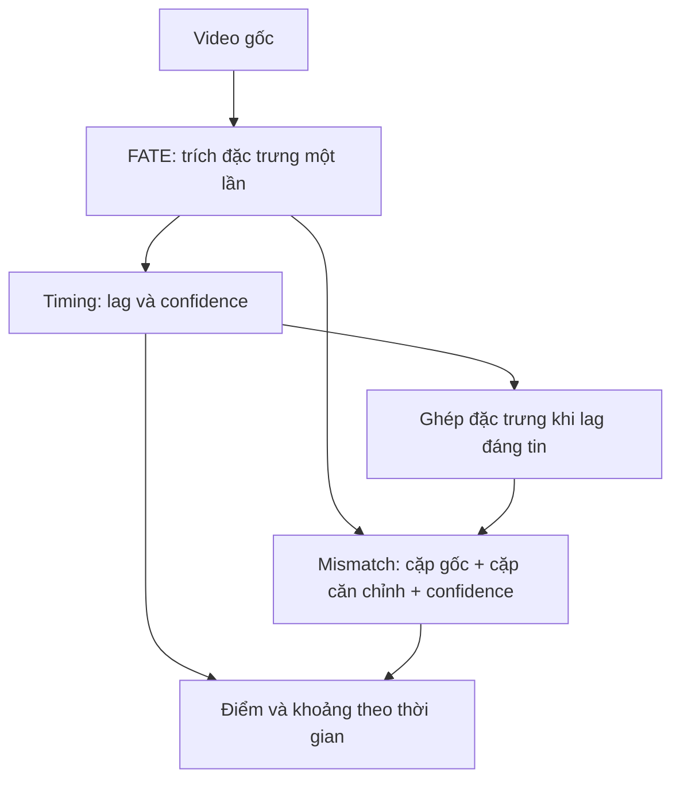

# Phát hiện và định vị bất nhất âm thanh–chuyển động môi

## 1. Phạm vi hai nhánh

Input: video một người nói, có audio và thấy rõ miệng. Output: điểm/khoảng lệch thời gian và điểm/khoảng bất nhất môi–âm thanh còn lại sau khi xét căn chỉnh hợp lý. Không kết luận thật/giả, kỹ thuật chỉnh sửa, âm vị cụ thể hay danh tính người nói.

| Nhánh | Định nghĩa | Không đủ bằng chứng |
|---|---|---|
| timing | Ước lượng lag có dấu; tổng hợp global/local | Lag null, không tự quy thành mismatch |
| lip_audio_mismatch | Audio không tương thích với chuyển động môi dù đã xét dịch thời gian hợp lý | Điểm được chấp nhận null; có thể xem chẩn đoán |

Sequence, phoneme–viseme và motion–speech được gộp thành mục tiêu mismatch chung. Đây là các biểu hiện/nhóm đánh giá, không còn ba head riêng. Source/identity được đưa ra ngoài phạm vi hiện tại.

## 2. Kiến trúc

**Một backbone FATE → hai head dùng chung đặc trưng → tổng hợp theo thời gian.**

FATE hiện tạo đặc trưng audio và crop khuôn mặt, chưa nhận dạng âm vị hay chuyển động môi riêng biệt. Giữ backbone này để thực nghiệm; số head giảm không chứng minh độ nhạy môi của đặc trưng đã đủ.

Lag dương nghĩa audio đi trước hình: A(t) đối chiếu V(t+k). Chỉ dịch chỉ mục đặc trưng, không sửa/encode lại video và không chạy FATE lần hai. Khi không căn chỉnh đáng tin, mismatch dùng cặp gốc với cờ confidence; chỉ được kết luận nếu kiểm tra validation riêng cho nhóm này đạt. Vùng thiếu bằng chứng không được nối khoảng qua.

Cửa sổ 2 giây, bước 0,2 giây và 8 nhóm token là thiết lập tính toán, không phải độ chính xác định vị đã đo.

## 3. Generator, nhãn và huấn luyện

Giữ ba folder độc lập: data thu clip sạch; generation chia nhóm rồi lưu MP4/nhãn; training chỉ nhận dataset đã tạo. [Lệnh chạy](README.md).

Có năm kỹ thuật: global_lag, local_lag, sequence_swap, content_splice, motion_freeze; thêm clean đối chứng. Tạo đủ offset ±0,2/0,4/0,6/0,8 giây. Donor và mọi biến thể ở cùng split với nguồn; sạch và mẫu sửa encode cùng chính sách.

Timing có offset đã biết ở vùng nguồn hợp lệ. Mismatch trên mẫu lag thuần túy là 0, tránh học nhầm timing thành nội dung. Thay câu/ghép audio/đóng băng chỉ có nhãn dương sau duyệt. Biên sửa, padding và nhãn chưa chắc được bỏ khỏi loss. Đóng băng toàn hình còn có nguy cơ tạo dấu hiệu dễ học; đo riêng từng kỹ thuật.

Chuyển nhãn cũ: hợp các vùng positive sequence/phoneme_viseme/motion_speech; negative chỉ khi cả ba được xác nhận khớp hoặc nhãn chung đã được duyệt trực tiếp. Source không tham gia. Migration xuất manifest mới, không sửa video hay nhãn gốc.

Train một model: đóng băng FATE, cache đặc trưng; 3 epoch timing warmup rồi 20 epoch joint tối đa. Loss có trọng số cho timing và mismatch, bỏ nhãn -1. Không dùng căn chỉnh đáp án khi validation/test. Một checkpoint chứa cả hai head; best.pt chỉ chọn trong giai đoạn joint. Resume giữ trạng thái optimizer, phase và RNG.

## 4. Đánh giá và giới hạn

Báo precision/recall/FAR, coverage, MAE lag, event F1 và kết quả từng generator. Chọn threshold trên validation; không chỉnh ngưỡng theo test. Model phải vượt kiểm tra chất lượng trước khi góp vào kết luận demo.

Test bằng nguồn/người mới, video thật khớp/lệch tự nhiên và bất nhất khó chưa gặp. Có thể thử GRID trước; kết quả tiếng Anh chưa chứng minh cho tiếng Việt. Hai cửa sổ chồng nhau không phải hai mẫu thống kê độc lập.

Checkpoint năm head cũ chỉ là kết quả lịch sử, không tương thích với checkpoint fate-two-heads-v1. Phải tạo hoặc migrate dataset rồi train mới. Code chạy và kiểm thử phần mềm đạt không thay thế việc đo hiệu quả detector.

Các công trình dưới đây giữ lại từ khảo sát trước, chưa được xác minh lại trong lần sửa code này. Các hướng active-speaker/identity nằm ngoài phạm vi hai nhánh hiện tại.

## 5. Kiến trúc chưa triển khai - giữ để tích hợp sau

Trạng thái weights dưới đây là kết quả khảo sát, cần kiểm tra lại khi tích hợp; không có nghĩa đã tải/chạy thành công. Đối chứng dùng để so sánh, không bắt buộc đưa vào đường suy luận.

| Công trình | Vai trò có thể bổ sung | Điều kiện cân nhắc |
|---|---|---|
| [SyncLipMAE - 2026](https://arxiv.org/html/2510.10069v2) | Backbone chuyên khuôn mặt nói | Khi FATE thiếu độ nhạy môi-tiếng; chưa xác minh weights chính thức. Token identity không tự xác minh giọng-mặt |
| [CoGenAV - 2025](https://github.com/HumanMLLM/CoGenAV) | Backbone speech AV thay thế | Có công bố weights; cần so sánh cùng dữ liệu trước khi thay |
| [AuViRe - WACV 2026](https://github.com/mever-team/auvire) | Đối chứng định vị, tham khảo tái dựng chéo | Có code/weights; nhãn forgery không thay thế nhãn quan hệ |
| [GateFusion - WACV 2026](https://openaccess.thecvf.com/content/WACV2026/html/Wang_GateFusion_Hierarchical_Gated_Cross-Modal_Fusion_for_Active_Speaker_Detection_WACV_2026_paper.html) | Active speaker | Khi nhánh nguồn/activity chưa đạt; chưa xác minh weights |
| [C³ASD - tác giả ghi ECCV 2026](https://jisoo-o.github.io/website/projects/C3ASD/) | Active speaker trong điều kiện khó | Khi cần cải thiện với nhiễu/che khuất; xác minh checkpoint trước |
| [ViSpeechFormer - 2026](https://arxiv.org/abs/2602.10003) | Tham khảo biểu diễn âm vị tiếng Việt | Chưa xác minh code/weights và timestamp âm vị sẵn dùng |
| [NPVForensics - 2025](https://www.sciencedirect.com/science/article/pii/S0262885625000496) | Tương quan phoneme-viseme | Khi mở rộng ngoài nhóm âm khép môi; cần thích nghi với định vị và tiếng Việt |
| [Beyond Time Shifts - repo ghi ECCV 2026](https://github.com/chenhaoqcdyq/BeyondTimeShifts) | Đối chứng điểm đồng bộ clip | Có đường dẫn checkpoint; không thay thế lag và ranh giới |
| [Synchformer - ICASSP 2024](https://github.com/v-iashin/Synchformer) | Đối chứng timing | Có checkpoint LRS3; dùng làm mốc đo |
| [AS-Synchformer - BMVC 2025](https://bmvc2025.bmva.org/proceedings/903/) | Đồng bộ streaming | Khi cần streaming; miền egocentric chưa chứng minh phù hợp khẩu hình |
| [LoCC - 2026](https://arxiv.org/abs/2606.22772) | Đối chứng định vị lip-sync forgery | Không thay thế phép đo mọi quan hệ audio-mouth |
| [When Speech Meets Lips - 2026](https://arxiv.org/abs/2609.06788) | Giải thích căn chỉnh/phát âm | Khi cần giải thích sự kiện; chưa là detector mismatch tiếng Việt sẵn dùng |
